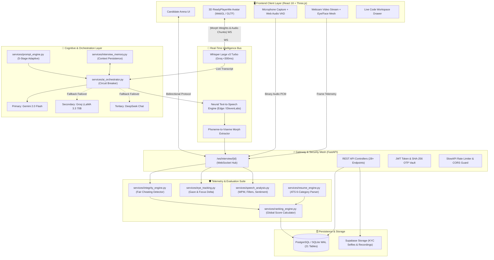
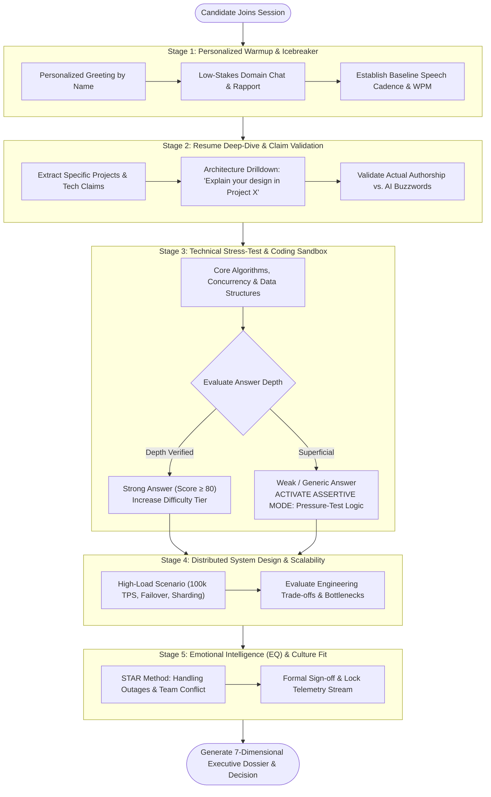
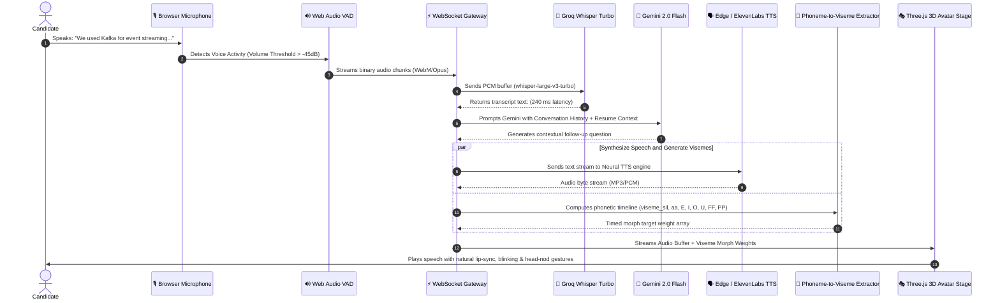
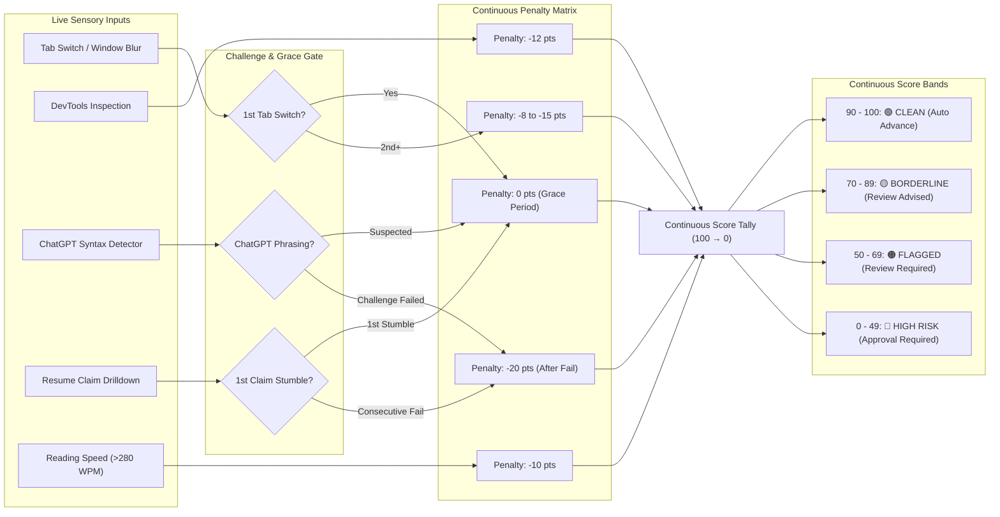

# 🎙️ Sterling AI — Autonomous Multi-Modal AI Interview Platform & Behavioral Proctoring OS

> **Next-Generation Autonomous Talent Acquisition & Real-Time Cognitive Assessment Engine**  
> Built for end-to-end autonomous candidate interviewing across **Real-Time WebSockets**, **3D WebGL Rigged Avatars (ReadyPlayerMe)**, **Whisper Speech-to-Text**, **Google Gemini 2.0 Flash Reasoning**, and **Fair Continuous Proctoring Telemetry**.  
>  
> 🌐 **Live Production Application:** **[https://ai-interview-portal.vercel.app/](https://ai-interview-portal.vercel.app/)**

---

<div align="center">

[](https://ai-interview-portal.vercel.app/)
[](file:///Main.py)
[](file:///Main.py)
[](file:///frontend/)
[](file:///frontend/src/components/Avatar3D.jsx)
[](file:///services/gemini_service.py)
[](file:///services/whisper_service.py)
[](file:///database/models.py)
[](file:///LICENSE)

<br/>

<p align="center">
  <a href="https://ai-interview-portal.vercel.app/">
    
  </a>
</p>

<p align="center">
  <b>Architected & Developed by Aditya Singh (<a href="https://github.com/adityasingh1786">@adityasingh1786</a>)</b>
</p>

</div>

---

## 📸 Executive Overview

```
┌─────────────────────────────────────────────────────────────────────────────────────────┐
│                              STERLING AI PLATFORM SUITE                                  │
├───────────────────────────────┬───────────────────────────────┬─────────────────────────┤
│  🎭 CANDIDATE ARENA           │  🧠 AI BRAIN ENGINE           │  🛡️ SUPERVISOR DASHBOARD │
│  • 3D WebGL Photoreal Avatar  │  • Gemini 2.0 Flash Reasoning │  • Live HR Intervention │
│  • Real-Time Viseme Lip-Sync  │  • Groq Whisper STT (<300ms)  │  • 7-Dimensional Radar  │
│  • Integrated Code Sandbox    │  • 5-Stage Adaptive Prompts   │  • Integrity Heatmap    │
│  • Voice-Activity VAD Engine  │  • Multi-LLM Circuit Breaker  │  • One-Click Dossiers   │
└───────────────────────────────┴───────────────────────────────┴─────────────────────────┘
```

---

## 💡 The Problem: The Death of 40-Hour Interview Cycles

Traditional engineering hiring is fundamentally broken:

1. **Recruiter Burnout & Fatigue:** Senior engineers spend 15–20 hours every week conducting repetitive Tier-1 screens rather than writing production code.
2. **The "Resume Inflation" Crisis:** Candidates use AI to craft immaculate resumes with buzzwords they cannot defend in live architectural discussions.
3. **Proxy Candidates & Covert Cheating:** Remote interviews suffer from off-screen second monitors, hidden ChatGPT tabs, whisper coaches, and automated browser extensions.
4. **Subjective Human Bias:** Scoring varies wildly depending on whether the interviewer conducted the screen before lunch or after a grueling sprint review.

### 🛡️ The Sterling AI Solution
Sterling AI acts as an **autonomous, unblinking, perfectly objective technical recruiter**:
- Interrogates candidates with **dynamic, non-scripted follow-up questions** tailored to their exact resume projects.
- Speaks naturally with **sub-second audio latency**, authentic speech pauses, and synchronized 3D avatar facial morph targets.
- Runs an unobtrusive **continuous integrity engine** that protects honest candidates with grace periods while systematically flagging AI syntax and screen-hopping.
- Produces a comprehensive **7-dimensional executive report and hiring decision** within seconds of call completion.

---

## 🏛️ High-Level System Topology

Sterling AI decouples real-time audio streaming, generative reasoning, and stateful proctoring across asynchronous event loops:



---

## 🧠 The 5-Stage Adaptive Questioning Engine

Sterling AI does not read from static question lists. It dynamically scales difficulty up or down using a **5-stage cognitive state machine**:



### 🎯 The 5 Experience Tiers

The prompt engine adapts its evaluation threshold to the candidate's verified career experience:

| Tier | Experience | Starting Difficulty | Primary Focus Breakdown |
| :--- | :--- | :---: | :--- |
| **Tier 1 — Fresher** | 0 – 1 yrs | `Easy (2)` | **25% Projects**, **20% Technical**, **20% Communication**, **15% Learning Ability** |
| **Tier 2 — Junior** | 1 – 3 yrs | `Easy (2)` | **30% Technical**, **20% Projects**, **20% Communication**, **15% Problem Solving** |
| **Tier 3 — Intermediate** | 3 – 6 yrs | `Moderate (3)` | **40% Technical**, **20% Problem Solving**, **15% Architecture**, **15% Communication** |
| **Tier 4 — Advanced** | 6 – 10 yrs | `Advanced (4)` | **50% Technical**, **20% Architecture**, **15% Leadership**, **10% Problem Solving** |
| **Tier 5 — Expert** | 10+ yrs | `Expert (5)` | **35% Architecture**, **25% Leadership**, **20% Strategy**, **10% Technical Depth** |

---

## 🎭 3D Avatar Lip-Sync & Audio Streaming Pipeline



---

## 🛡️ The Fair Cheating Detection Engine

Most automated proctoring software triggers false positives for innocent behaviors (like looking down to write notes). Sterling AI enforces a **Fair Cheating Philosophy & Human Firewall**:
- **No binary guilty flags:** Computes a continuous `integrity_score` ($100 \rightarrow 0$).
- **Grace Periods:** Initial tab switches and isolated pauses incur **zero penalty**.
- **Challenge-Gating:** Suspected ChatGPT syntax triggers a hard follow-up question before any point deduction occurs.
- **The Human Firewall:** The algorithm flags; human recruiters make all final hiring decisions.



---

## 🧮 Mathematical Scoring & Decision Matrix

At the conclusion of the interview session, the `RankingEngine` synthesizes all evaluation vectors into a balanced **Global Score**:

$$\text{GlobalScore} = \sum_{k \in \text{Dimensions}} \left( W_{\text{role}, k} \times S_k \right)$$

Where the dimensions and default weights are defined as:

$$\begin{aligned}
\text{GlobalScore} = \;& 0.30 \cdot S_{\text{technical}} + 0.20 \cdot S_{\text{resume}} + 0.15 \cdot S_{\text{communication}} \\
& + 0.10 \cdot S_{\text{confidence}} + 0.10 \cdot S_{\text{behavioral}} + 0.08 \cdot S_{\text{fluency}} + 0.07 \cdot S_{\text{eq}}
\end{aligned}$$

### 🎯 Automated Hiring Decision Tree

A candidate's global score is gated by their technical competence to prevent articulate candidates with zero coding ability from slipping through:

```
                  ┌──────────────────────────────┐
                  │ Global Score ≥ 80            │
                  │ AND Technical Score ≥ 70     │
                  └──────────────┬───────────────┘
                                 │
                     ┌───────────┴───────────┐
                    YES                      NO
                     │                       │
           ┌─────────────────┐      ┌──────────────────────────────┐
           │ 🟢 STRONG HIRE  │      │ Global Score ≥ 65            │
           │ Direct Offer    │      │ AND Technical Score ≥ 55     │
           └─────────────────┘      └──────────────┬───────────────┘
                                                   │
                                       ┌───────────┴───────────┐
                                      YES                      NO
                                       │                       │
                             ┌─────────────────┐      ┌──────────────────────────────┐
                             │ 🔵 SHORTLISTED  │      │ Global Score ≥ 50            │
                             │ Advance to Exec │      └──────────────┬───────────────┘
                             └─────────────────┘                     │
                                                         ┌───────────┴───────────┐
                                                        YES                      NO
                                                         │                       │
                                               ┌──────────────────┐    ┌─────────────────┐
                                               │ 🟡 UNDER REVIEW  │    │ 🔴 NOT SELECTED │
                                               │ 2nd Tech Screen  │    │ Reapply 6 Mos   │
                                               └──────────────────┘    └─────────────────┘
```

---

## 🗄️ Relational Database Entity Topology

The backend utilizes SQLAlchemy ORM with **21 relational tables** supporting SQLite (WAL Mode) for local zero-dependency development and Supabase PostgreSQL for production scale:

```
database/models.py Architecture:
├── Department ──────────< JobRole ──────────< Candidate
│                             │                    │
│                             │                    ├──< Resume (Extracted Text, Skills, ATS Score)
│                             │                    ├──< SlotBooking ──────> InterviewSlot
│                             │                    └──< InterviewSession
│                             │                             │
│                             └──< QuestionBank             ├──< InterviewQuestionsLog
│                                      │                    ├──< CandidateAnswer
│                                      │                    ├──< KeywordEvaluation
│                                      │                    ├──< QuestionEvaluation
│                                      │                    ├──< ConversationHistory
│                                      │                    ├──< UnifiedInterviewData (Plagiarism)
│                                      │                    └──── FinalReport (7D Scores, Integrity)
│
├── OTPStore (SHA-256 Hashed Transient Authentication Vault)
├── AdminUser (RBAC: master_admin, sub_admin, reviewer)
├── SystemTelemetryLog (API counts, DB latency, active sessions, AI token usage)
├── AdminActivityLog (Audit trail of all administrative actions)
└── SecurityEventLog (Rate-limit breaches, suspicious auth attempts)
```

---

## 💻 Tech Stack Deep-Dive

### Backend Architecture
- **Language & Runtime:** Python 3.10+
- **Web Framework:** [FastAPI](https://fastapi.tiangolo.com/) with async ASGI event loops
- **WebSocket Protocol:** Low-overhead binary audio and JSON telemetry packets
- **AI Core:** [Google GenAI SDK](https://ai.google.dev/) (`gemini-2.0-flash`), [Groq SDK](https://groq.com/) (`llama-3.3-70b-versatile`)
- **Speech Processing:** `whisper-large-v3-turbo` (<300ms audio-to-text inference), Edge TTS / ElevenLabs
- **Computer Vision & Proctoring:** OpenCV (`cv2`), Tesseract OCR (`pytesseract` for Aadhar KYC verification)
- **Security:** `bcrypt`, `pyjwt`, SHA-256 OTP hashing, SlowAPI rate-limiting

### Frontend Architecture
- **Framework:** [React 18](https://react.dev/) + [Vite](https://vitejs.dev/)
- **3D Graphics:** [Three.js](https://threejs.org/) + WebGL Canvas (ReadyPlayerMe skinned morph meshes)
- **Styling:** [Tailwind CSS](https://tailwindcss.com/) + Custom Glassmorphism UI
- **State Management:** [Zustand](https://github.com/pmndrs/zustand) (`useInterviewStore`)
- **Animations & Interaction:** Canvas particle systems, dynamic audio waveform visualizers

---

## 🚀 Installation & Quickstart Guide

### Prerequisites
- **Python:** `3.10` or higher
- **Node.js:** `v18.0.0` or higher
- **Package Managers:** `pip` and `npm`

---

### Step 1: Clone the Repository
```bash
git clone https://github.com/adityasingh1786/AI-Interview-Portal.git
cd AI-Interview-Portal
```

---

### Step 2: Backend Setup
```bash
# 1. Create and activate a virtual environment
python -m venv venv

# On Windows (PowerShell):
venv\Scripts\Activate.ps1
# On Linux/macOS:
source venv/bin/activate

# 2. Install dependencies
pip install -r requirements.txt

# 3. Configure environment variables
cp .env.example .env
```

Open `.env` and configure your API keys:
```env
GEMINI_API_KEY=your_gemini_api_key_here
GROQ_API_KEY=your_groq_api_key_here
JWT_SECRET=your_super_secret_jwt_random_key_here
MASTER_ADMIN_PASSWORD=SetAStrongPassword123!
```

---

### Step 3: Frontend Setup
```bash
# Navigate to frontend and install dependencies
cd frontend
npm install
cd ..
```

---

### Step 4: Run the Application

#### Terminal 1 — Start the Backend:
```bash
# Run FastAPI with Uvicorn hot-reloading
uvicorn Main:app --reload --host 0.0.0.0 --port 8000
```
*API documentation will be live at: [http://localhost:8000/docs](http://localhost:8000/docs)*

#### Terminal 2 — Start the Frontend:
```bash
cd frontend
npm run dev
```
*Frontend application will be live at: [http://localhost:5173](http://localhost:5173)*

---

## 🐳 Docker Deployment

To launch the backend using containerization:

```bash
# Build the Docker image
docker build -t sterling-interview-backend .

# Run the container
docker run -d -p 8000:8000 --env-file .env --name interview-portal sterling-interview-backend
```

---

## ☁️ Cloud Production Deployment

The repository includes pre-configured deployment manifests:
- **Backend on Render:** [render.yaml](file:///render.yaml) defines auto-provisioning for FastAPI with Python runtime.
- **Frontend on Vercel:** Live in production at **[https://ai-interview-portal.vercel.app/](https://ai-interview-portal.vercel.app/)** (configured with SPA rewrites via [frontend/vercel.json](file:///frontend/vercel.json)).
- **Database on Supabase:** Run [database_migration_candidate_cancellation.sql](file:///database_migration_candidate_cancellation.sql) inside the Supabase SQL editor.

---

## 👨‍💻 Engineering & Authorship

**Aditya Singh**  
- **GitHub:** [@adityasingh1786](https://github.com/adityasingh1786)  
- **Email:** pratyushaditya06@gmail.com  
- **Role:** System Architect & Full-Stack AI Engineer  

---

## 📜 License

This project is licensed under the **MIT License** — feel free to use, modify, and distribute with attribution. See the [LICENSE](file:///LICENSE) file for complete details.
